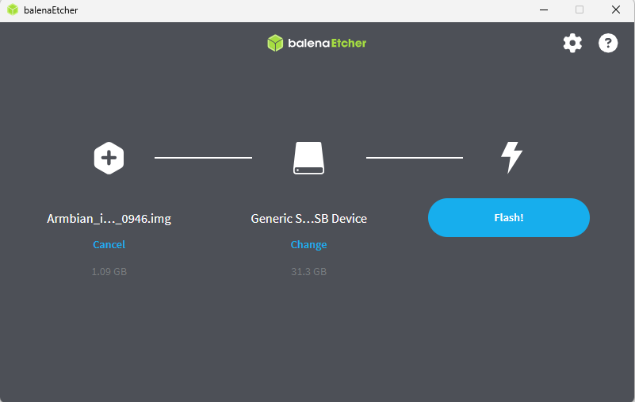
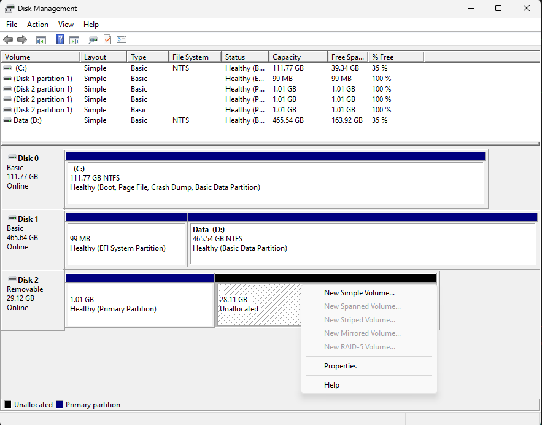
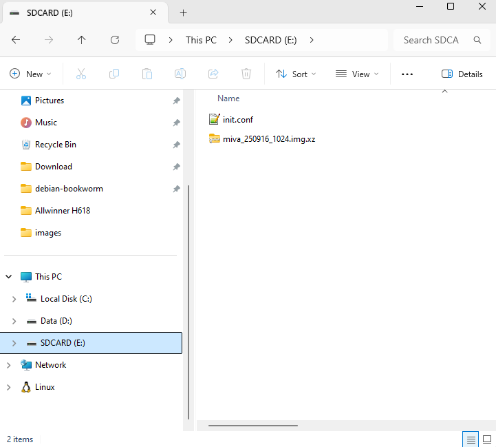
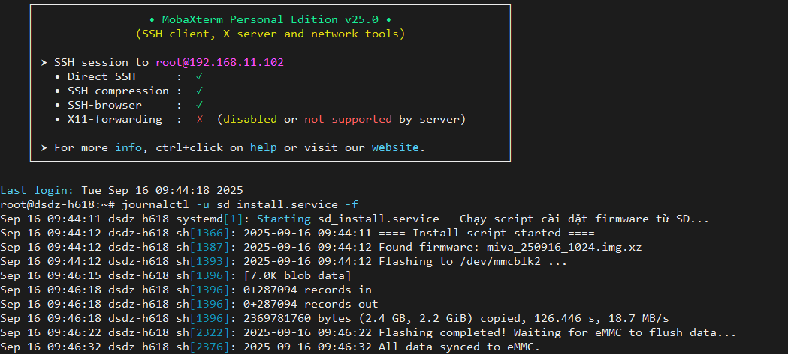

# Tạo thẻ SD bộ cài cho Allwiner H618 (Miva -Mira)

---
## 📦 Bước 1: Tải file cài đặt

- Vào [Release](https://github.com/hoangvh/miva-armbian-build/releases) trên GitHub.
- Tải file `Armbian_install_yymmdd_hhmm.img.xz` để tạo bộ cài đặt tự động trên thẻ sd
- Tải file `miva_250916_1024.img.xz` để copy firmware từ thẻ sd vào emmc trên thiết bị.

---

## 💽 Bước 2: Ghi image vào thẻ nhớ

- Sử dụng **Balena Etcher** để cài đặt image vào thẻ nhớ.
- Chọn image vừa tải và thẻ nhớ, nhấn **Flash**.



---

## 🗂 Bước 3: Tạo phân vùng FAT32 trên Windows 10/11

- Nhấn Windows, gõ disk management để mở **Disk Management**.
- Chọn thẻ nhớ, bấm chuột phải vào phân vùng **Unallocated** chọn **New Simple Volume**... -> chọn *Next*.
  
 
 
- Chọn các tham số như hình minh họa dưới -> bấm *Next* -> *Finish*.

 

- Lưu ý: phân vùng này sẽ chứa file cấu hình và image của thiết bị.

---

## 📂 Bước 4: Copy file cấu hình và image

1. Copy **init.conf** và file **firmware** của thiết bị H618 vào phân vùng FAT32 vừa tạo trên thẻ.
 
2. Chỉnh lại tên file `image_file` trong **init.conf**:
   ```ini
   image_file=Tên_file.xz  # hoặc .gz / .img
   
## 📂 Bước 5: Cài đặt firmware vào eMMC

1. Cắm thẻ vào khe sdcard trên thiết bị H618, cấp nguồn.
2. Truy cập SSH vào thiết bị tại địa chỉ ip: 192.168.11.102 hoặc UART
3. Gõ lệnh để kiểm tra quá trình cài đặt firmware vào emmc
   ```ini
   journalctl -u sd_install.service -f
   

-  Nếu log thông báo `All data synced to eMMC.` là đã cài đặt xong
4. Các trạng thái đèn server (led màu đỏ):
- Đèn server nháy nhanh: đang cài đặt.
- Đèn server nháy chậm: cài đặt xong.
- Đèn server không nháy: Lỗi không có image hoặc file init.conf , cần kiểm tra lại bộ cài.
5. Tắt thiết bị:
- Gõ lệnh shutdown -h now
- Chờ cho đèn tắt hẳn rồi rút nguồn, rút thẻ nhớ.
- Chuẩn bị bước thiết lập cài đặt lần đầu trên thiết bị
  
## 📂 Bước 6: Cài đặt ứng dụng

1. Cắm thẻ nhớ vào thiết bị, cấp nguồn.
2. Ứng dụng (**miva/mira**) sẽ tự động cài đặt khi thiết bị có kết nối internet.  
3. Địa chỉ IP mặc định `192.168.11.102` có thể chưa kết nối được ra internet, cần đổi lại địa chỉ IP cho thiết bị.  

   Thực hiện tuần tự các lệnh sau:
   ```bash
   nano /etc/netplan/00-default-use-network-manager.yaml
   netplan apply
   systemctl restart miva-setup.service
   journalctl -u miva-setup.service -f
