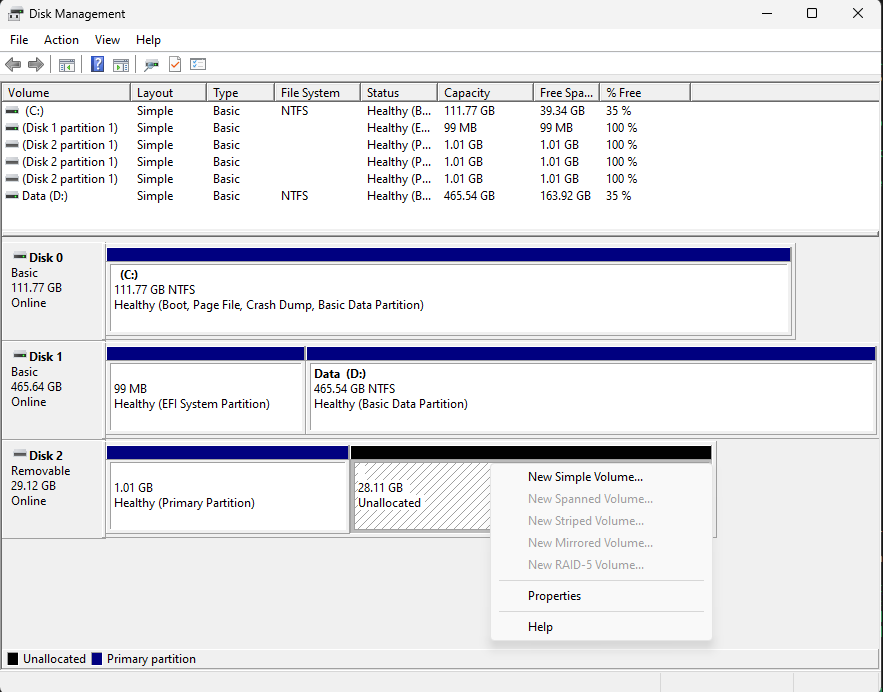

# Tạo thẻ SD bộ cài cho Allwiner H618 (Miva -Mira)

---
## 📦 Bước 1: Tải file cài đặt

- Vào [Release](https://github.com/hoangvh/miva-armbian-build/releases) trên GitHub.
- Tải file `Armbian_install_yymmdd_hhmm.img.xz`.

---

## 💽 Bước 2: Ghi image vào thẻ nhớ

- Sử dụng **Balena Etcher** để cài đặt image vào thẻ nhớ.
- Chọn image vừa tải và thẻ nhớ, nhấn **Flash**.


---

## 🗂 Bước 3: Tạo phân vùng FAT32 trên Windows 10/11

- Nhấn Windows, gõ disk management để mở **Disk Management**.
- Chọn thẻ nhớ, bấm chuột phải vào phân vùng Unllocated chọn New Simple Volume... -> chọn Next 3 lần
  
- Chọn các tham số như hình minh họa dưới -> bấm Next -> Finish
  
- Lưu ý: phân vùng này sẽ chứa file cấu hình và image của thiết bị.

---

## 📂 Bước 4: Copy file cấu hình và image

1. Copy **init.conf** và file **firmware** của thiết bị H618 vào phân vùng FAT32 vừa tạo trên thẻ.  
2. Chỉnh lại tên file `image_file` trong **init.conf**:
   ```ini
   image_file=Tên_file.xz  # hoặc .gz / .img
