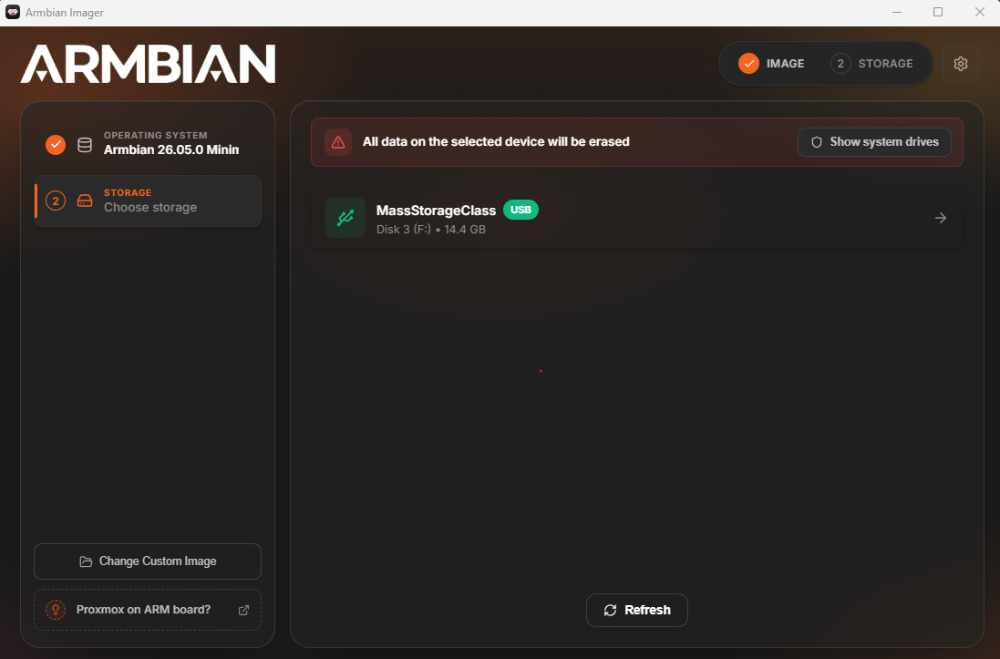
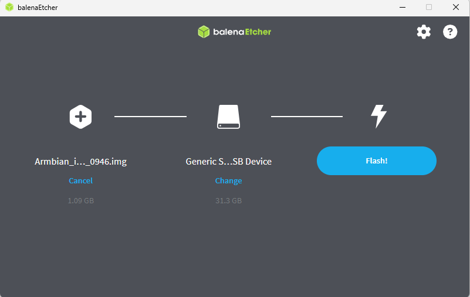
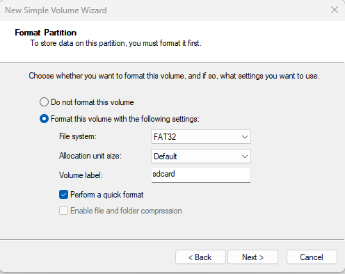
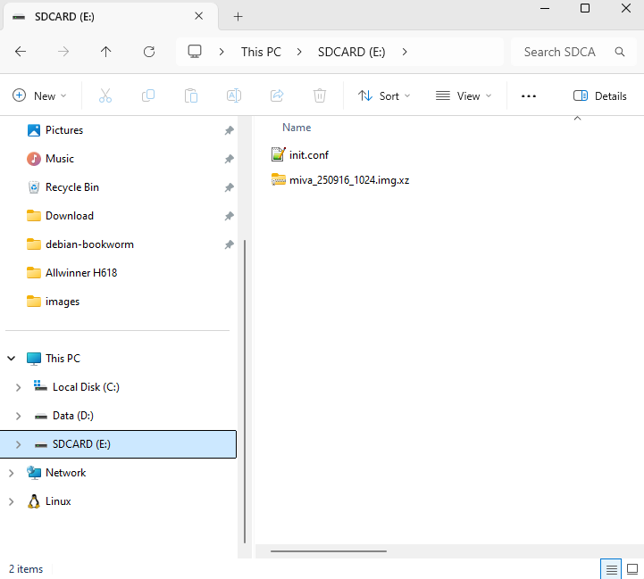

# Bộ cài MIVA DSDZ-H618 LPDDR3

## 1. Tạo thẻ SD

1. Tải image mới nhất trong [Release](https://github.com/hoangvh/miva-armbian-install-image/releases), có đuôi `.img.xz` (hoặc `.img`).
2. Ghi image vào thẻ SD bằng Armbian Imager hoặc Balena Etcher.
3. Tạo một phân vùng FAT32 riêng, đặt nhãn chính xác là `MIVA-CONFIG`.
4. Chép vào thư mục gốc phân vùng FAT32: `init.conf`, image firmware cùng file `.sha256`, và `miva-v3.0.5p8.tar` nếu cài Docker offline.



Nếu dùng Balena Etcher:



## 2. Cấu hình `init.conf`

Chỉ chỉnh image, mạng SD/eMMC, mật khẩu, hostname và MIVA tag:

```ini
IMAGE_FILE=miva-lpddr3-YYMMDD-HHMM.img.xz
VERIFY_SHA256=yes
INSTALLER_IP=192.168.10.48
INSTALLER_PREFIX=24
INSTALLER_GATEWAY=192.168.10.1
INSTALLER_DNS=192.168.10.1,1.1.1.1
INSTALLER_PASSWORD=change-me-installer
DEVICE_IP=192.168.1.102
DEVICE_PREFIX=24
DEVICE_GATEWAY=192.168.1.1
DEVICE_DNS=192.168.1.1,1.1.1.1
DEVICE_PASSWORD=admin123@
DEVICE_HOSTNAME=miva
MIVA_TAG=v3.0.5p8
LED_GPIO=262
SHUTDOWN_AFTER=yes
```

`IMAGE_FILE` phải trùng tuyệt đối tên file. Cả `.img` và `.img.xz` đều được hỗ trợ.

Không cần khai báo `FIRSTBOOT_SETUP`, `FEATURE_DISPLAY`, `FEATURE_MPV`, `FEATURE_HW_VIDEO`, `FEATURE_HDMI_HOTPLUG`, `MIVA_INSTALL`, `MIVA_BRANCH` hoặc `MIVA_NETWORK`; các phần này đã tích hợp trong firmware.



Sau khi tạo phân vùng, chép các file cài đặt vào phân vùng `MIVA-CONFIG`:



## 3. Cài vào eMMC

1. Cắm thẻ SD và cấp nguồn.
2. Theo dõi service duy nhất:

```sh
journalctl -b -u miva-bootstrap.service -f
```

3. Khi hoàn tất, board tự tắt nếu `SHUTDOWN_AFTER=yes`.
4. Tháo thẻ SD rồi khởi động lại từ eMMC.

### Trạng thái LED

LED mặc định dùng `LED_GPIO=262` và active-high:

| Trạng thái LED | Ý nghĩa |
| --- | --- |
| Nháy nhanh, khoảng 0,1 giây bật/tắt | Đang ghi image vào eMMC hoặc đang khởi tạo Docker MIVA. Không tắt nguồn. |
| Nháy chậm, khoảng 0,6 giây bật/tắt | Bước hiện tại đã hoàn tất. Sau khi ghi eMMC, đây là tín hiệu có thể tắt nguồn/tháo SD nếu board chưa tự tắt. |
| Nháy 3 lần nhanh, nghỉ khoảng 1 giây, lặp lại | Có lỗi. Xem log bằng `journalctl -b -u miva-bootstrap.service --no-pager`. |
| Tắt | Chưa chạy, đã kết thúc bước thành công sau thời gian báo hiệu, hoặc GPIO LED không khả dụng. |

## 4. Cài MIVA lần đầu

Khi boot từ eMMC, `miva-bootstrap.service` sẽ chép ứng dụng vào `/home/miva`, nạp file tar offline, chạy `generate-devices.sh`, vô hiệu hóa dòng `/dev/ttyS0` gây xung đột và chạy `docker compose up -d`.

Kiểm tra bằng:

```sh
journalctl -b -u miva-bootstrap.service --no-pager
docker ps
ip a
```

Trong lần boot eMMC đầu tiên, LED nháy nhanh trong lúc nạp image Docker và khởi động compose; khi ứng dụng MIVA chạy thành công, LED chuyển sang nháy chậm trong khoảng 10 giây rồi tắt. Các lần boot sau không chạy lại bước cài đặt Docker.

Sau lần đầu, Docker tự khởi động lại theo `restart: unless-stopped`; bootstrap không cài lại khi đã có state marker.
